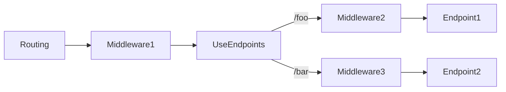

## Per route middleware

This sample shows how to wire up middleware per route. The diagram below shows what the execution looks like when this is applied.

```mermaid
flowchart LR
A[Routing] --> B[Middleware1]
B --> C[UseEndpoints]
C --> |/foo| D[Middleware2]
C --> |/bar| E[Middleware3]
D --> F[Endpoint1]
E --> G[Endpoint2]
```
